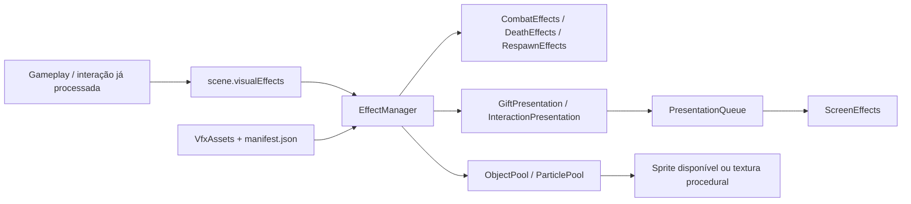

# LIVE ARENA — VFX upgrade

Base: v0.09.0, commit `82e27c43ac099d4b3d851b7b7bacbe8e11da7c6c`. Branch: `feat/vfx-upgrade`. Esta atualização altera apresentação. Dano, movimentação, HP, alcance, cooldowns, pontuação, fila, rodadas, eventos e bônus continuam nas classes originais.

## Testar no Windows

Os comandos devem ser executados **dentro da pasta do repositório**, que contém `.git`, `package.json` e `package-lock.json`. `D:\projetos` sozinho é apenas a pasta que contém os projetos.

Se você ainda não clonou:

```powershell
cd D:\projetos
git clone --branch feat/vfx-upgrade https://github.com/lucascanalli-tech/Tklives.git
cd Tklives
npm.cmd ci
npm.cmd start
```

Se o clone já existe:

```powershell
cd D:\projetos\Tklives
git fetch origin
git switch feat/vfx-upgrade
npm.cmd ci
npm.cmd start
```

Requer Node.js >= 20.19. O servidor informa a porta; o padrão é 8080. Sem configuração TikTok, inicia em modo simulador.

- Jogo: `http://localhost:8080/?mode=simulator`
- Laboratório: `http://localhost:8080/?mode=simulator&debugVfx=1`
- Vertical: `http://localhost:8080/?mode=simulator&layout=portrait&debugVfx=1`
- Carga: `http://localhost:8080/?load=40&maxActive=40`
- Qualidade: `&vfxQuality=LOW`, `MEDIUM` (padrão) ou `HIGH`.
- Desativar shake: `&vfxShake=off`. Desativar ambiente: `&vfxAmbient=off`.

O laboratório tem 13 prévias e “Demonstrar todos”. Os dois personagens de prévia não entram no registro de participantes. Os botões chamam somente a camada visual: não publicam eventos, não aplicam dano/bônus e não concedem pontos. O simulador normal continua funcionando. Os atores, posições, sequência e sementes visuais das prévias são fixos. O painel só existe com `debugVfx=1`, inclusive no modo LIVE; use o controle de recolher no vertical para ver toda a arena.

## Organização



`VisualEffects.js` mantém o nome usado pela cena, reexportando `EffectManager`. Não existe um segundo barramento. `AutoCombat` permanece integralmente igual e continua chamando `attack(player, target)` depois de aplicar o dano. `HealthSystem` chama `hit`, `death` e `respawn` sem mudar nenhuma operação lógica ou timer. `Player` chama `spawn` e libera sua apresentação ao sair da arena. `InteractionEffects` mantém os bônus e cooldowns e encaminha apenas a apresentação.

Os métodos públicos são `spawn`, `attack`, `hit`, `death`, `respawn`, `interaction` e `gift`. `ring` e `text` continuam disponíveis para compatibilidade. Nenhum arquivo de gameplay conhece nome de spritesheet ou caminho de asset.

`EffectManager.update` avança os efeitos no frame da cena. Partículas, sprites, balões e banners não criam timers ou tweens por efeito. A camada possui pools separados, limites globais, canais temporários por jogador e limpeza no shutdown. Os pools crescem até seu limite e reutilizam os objetos; não são destruídos e recriados a cada ataque.

O RNG visual é independente. A criação síncrona de texto também é isolada, pois o Phaser 3.90 usa `Math.random` internamente para o UUID da textura de texto. `createVisualObject` restaura o gerador original em `finally`; não pode envolver chamadas assíncronas. Assim, aumentar a qualidade ou criar partículas não consome sorteios de movimento/respawn.

## Efeitos e tempos

| Efeito | Apresentação | Separação da lógica |
|---|---|---|
| Ataque | Slash, projétil de energia de 170 ms e trail curto | Dano continua imediato; o projétil não tem colisão ou callback de dano |
| Impacto | Sparks, anel, flash e punch de 140 ms no corpo | Só altera o desenho dentro do container; coordenadas do avatar permanecem iguais |
| Número de dano | Texto breve, com canal por jogador e limite global | Opcional por qualidade; mostra o valor solicitado ao hit |
| Morte | Cópia visual com dissolve/explosão de 520 ms | Original é ocultado e kill contabilizada imediatamente |
| Spawn/respawn | Portal, glow, partículas ascendentes e fade do nome | Respawn lógico continua em 2.000 ms, com HP 100 e mesmo sorteio de posição |
| LIKE | Quantidade agrupada e poucos corações | Continua usando a agregação de 250 ms existente |
| FOLLOW | Aura verde, burst e texto | Bônus original mantido |
| SHARE | Ondas azuis, glow e texto | Bônus original mantido |
| COMMENT | Balão com até 64 caracteres, um por jogador, máximo 6 | Tenta espaços livres e omite só o desenho quando não há espaço; bônus e evento permanecem |
| Ambiente | Partículas lentas, borda iluminada e sombreado sutil | Sem mudança no layout, personagem, hitbox ou arena lógica |

Não existe crítico no gameplay atual. A pasta/role `critical` está reservada para um sinal futuro; esta branch não inventa chance, dano ou mecanismo de crítico.

## Presentes

`game/config/GiftVisualConfig.js` é independente de `game/gifts/GiftConfig.js`. O segundo continua decidindo energia, cura e boost. O primeiro decide cores, tier de apresentação e prioridade.

| Tier visual | Fallback | Mapeamento visual padrão |
|---|---|---|
| COMMON | Burst dourado, anel e nome | Rose; desconhecido sem valor confiável; menos de 100 diamantes |
| RARE | Dois anéis, coluna de luz e nome | Finger Heart; 100–499 diamantes |
| EPIC | Aura violeta e banner de 1.400 ms | Galaxy; 500–999 diamantes |
| LEGENDARY | Burst maior, banner de 1.800 ms e flash muito breve | Lion; pelo menos 1.000 diamantes |

IDs e nomes explícitos têm prioridade sobre os limiares. Os exemplos de nomes são configurações visuais editáveis, não uma lista oficial de preços TikTok. Para adicionar um presente, ajuste `GIFT_VISUAL_IDS` ou `GIFT_VISUAL_NAMES`, ou deixe o fallback por `diamondCount` confiável atuar. Não altere `GiftConfig` para escolher VFX.

EPIC/LEGENDARY entram em uma fila de snapshots visuais com até oito pendentes e um banner ativo. LEGENDARY tem prioridade; a apresentação em curso termina normalmente. Um snapshot aguardando mais de seis segundos é descartado. Saturação descarta só apresentação; o `GiftManager` já processou o evento, deduplicou o combo e aplicou o bônus antes disso. COMMON/RARE são locais. O cooldown de apresentação GIFT de 700 ms continua igual.

Flash ocorre apenas em LEGENDARY, por até 160 ms e alpha máximo 0,055. Shake dura até 180 ms, deslocamento máximo 1,4 pixel, pode ser desativado e nunca ocorre em ataque normal. Não há pausa, slow motion ou mudança no relógio da rodada.

## Qualidade e limites

| Qualidade | Partículas | VFX temporários simultâneos | Textos no pool | Ambiente | Números de dano |
|---|---:|---:|---:|---:|---|
| LOW | 96 | 60 | 8 | 0 | Não |
| MEDIUM | 224 | 100 | 14 | 8 | Sim |
| HIGH | 360 | 100 | 20 | 14 | Sim |

`objects` inclui sprites e textos ativos. As capacidades dos pools são separadas; objetos inativos ficam disponíveis para reutilização. Bordas, um banner e um flash são objetos persistentes em quantidade fixa. `metrics()` informa ativos, alocados, pico, descartes, canais e fila. Nenhum desses limites altera participantes ativos, dano ou processamento de eventos.

## Assets externos, preload e fallback

Estado desta entrega: **nenhum asset Cooked FX ou Kenney foi importado**. A implementação usa texturas procedurais originais. A fonte/licença de Cooked FX não pôde ser confirmada; a página Kenney e os buscadores receberam bloqueio do proxy. Consulte [THIRD_PARTY_ASSETS.md](THIRD_PARTY_ASSETS.md) antes de instalar arquivos.

`assets/vfx/manifest.json` é o único ponto de cadastro. O manifest atual tem `assets: []`: não há requisições para PNGs inexistentes. `ArenaScene.preload` chama o loader central; ele aceita imagens PNG/WebP, spritesheets e atlas JSON, somente dentro de `assets/vfx`. No create, só texturas carregadas são disponibilizadas ao manager. Erro de download, arquivo ausente ou descriptor inválido conserva o fallback.

Depois de obter e verificar um arquivo licenciado, coloque-o na pasta correspondente e adicione um descriptor real. Exemplo de spritesheet **ilustrativo**, com dimensão a ajustar ao arquivo que você baixou:

```json
{
  "version": 1,
  "assets": [
    {
      "role": "hit",
      "type": "spritesheet",
      "path": "assets/vfx/combat/hit/hit-flat-night.png",
      "frameWidth": 64,
      "frameHeight": 64,
      "frameRate": 24,
      "scale": 1,
      "enabled": true
    }
  ]
}
```

Para imagem, use `type: "image"` e omita dimensões. As roles `particle.*` e `environment` usam imagens estáticas; use spritesheets/atlas nas roles de efeitos animados. Para atlas, use `type: "atlas"`, `path` para a textura e `atlas` para `assets/vfx/.../arquivo.json`. `frames` é uma lista opcional de nomes/índices de frames; sem ela, são utilizados os frames carregados, até 256. `tint: true` permite recolorir; o padrão preserva a paleta do artista. A animação é executada uma vez, dentro do tempo visual do efeito. Ajuste frame rate e seleção de frames a esse tempo. Paths devem ter nomes sem espaços; renomeie os arquivos ao instalar.

Roles disponíveis: `attack`, `hit`, `critical`, `death`, `spawn`, `respawn`, `gift.common`, `gift.rare`, `gift.epic`, `gift.legendary`, `like`, `follow`, `share`, `comment`, `particle.spark`, `particle.heart`, `particle.glow`, `particle.trail`, `environment`. `critical` e `particle.trail` são slots reservados; o trail atual utiliza glows. Cada role aceita um descriptor. Não basta copiar um arquivo de nome desconhecido: registre seu path no manifest e recarregue a página.

Para um efeito novo, crie um módulo de apresentação, invoque `sprite`/`external`/`particles.emit`, registre duração com `track` e exponha uma chamada genérica no manager. Mantenha dano, colisão, bônus, cooldowns e timers de gameplay fora desse módulo. Acrescente uma prévia em `VfxScenarios` para conferir a aparência sem eventos reais.

## Verificação

```bash
npm test
python test/browser.py
python test/vfx_browser.py --output /tmp/live-arena-vfx
```

O teste Python requer Playwright e Chromium e um servidor em modo SIMULATOR na porta 8080; `--port` muda a porta. Ele compara o baseline de gameplay nas três qualidades, testa as 13 prévias nos dois layouts, carrega fixtures originais de image/spritesheet/atlas, simula arquivo ausente, mede carga e repete 40 ciclos de saturação/limpeza. Resultados medidos e limites estão em [VFX_VALIDATION.md](VFX_VALIDATION.md).
